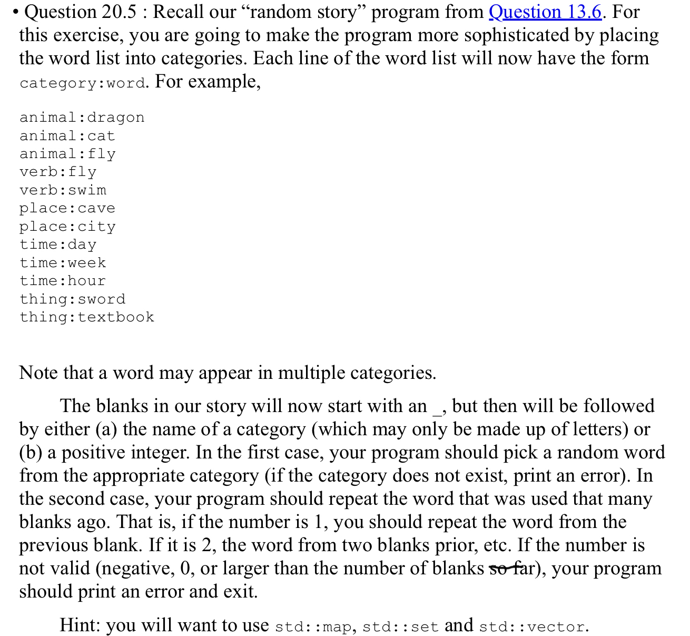

# random_story
Duke ECE 551 group work

Author: Zoe Yang, Luke Liu, Zhibo Jia, Zeying Huang
 

## Task description:

## Work Division：
1. Store story template from story text file into vector<stirng>. (Zoe)
2. Store categorys & words from words test file into map<string, set<string> >. (Luke)
3. Randomly choose word from specified category. (Zoe)
4. Replace 'blanks' in the story template with chosen word. (Zhibo & Zeying)

